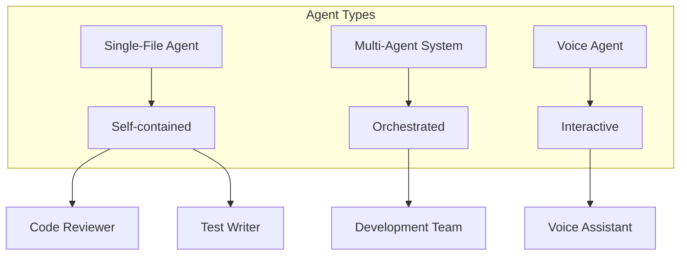

# Agents Overview

!!! success "Build Powerful AI Agents"
    Create single-file agents, multi-agent systems, and voice-enabled assistants using best practices from the Claude Code ecosystem.

## What Are Agents?

Agents are specialized AI assistants that perform specific tasks autonomously. They can be simple single-file scripts or complex multi-agent systems that coordinate to solve problems.



## Agent Architecture

<div class="grid cards" markdown>

-   :material-file-code:{ .lg .middle } **Single-File Agents**

    ---

    Self-contained scripts with embedded dependencies using UV

    ```python
    #!/usr/bin/env python3
    # /// script
    # requires-python = ">=3.9"
    # dependencies = ["openai", "rich"]
    # ///
    ```

-   :material-robot-multiple:{ .lg .middle } **Multi-Agent Systems**

    ---

    Coordinated teams of specialized agents

    ```python
    manager = AgentManager()
    results = await manager.orchestrate([
        ("reviewer", task1),
        ("tester", task2)
    ])
    ```

-   :material-microphone:{ .lg .middle } **Voice-Enabled Agents**

    ---

    Natural language interaction with voice I/O

    ```python
    agent = VoiceAgent()
    command = agent.listen()
    response = agent.process(command)
    agent.speak(response)
    ```

-   :material-infinity:{ .lg .middle } **Infinite Loops**

    ---

    Continuous improvement through iterative refinement

    ```python
    while True:
        result = agent.iterate()
        if result.is_optimal():
            break
    ```

</div>

## Quick Start Example

### Simple Code Review Agent

```python title="code_reviewer.py"
#!/usr/bin/env python3
# /// script
# requires-python = ">=3.9"
# dependencies = [
#   "openai",
#   "anthropic",
#   "rich",
#   "click",
# ]
# ///

"""Security-focused code review agent"""

import click
from rich.console import Console
from pathlib import Path
import json

console = Console()

class CodeReviewer:
    """AI-powered code review agent"""
    
    def __init__(self, model="gpt-4"):
        self.model = model
        self.issues = []
    
    def review_file(self, file_path: Path):
        """Review a single file for issues"""
        console.print(f"[cyan]Reviewing:[/cyan] {file_path}")
        
        content = file_path.read_text()
        
        # Security checks
        security_issues = self.check_security(content)
        
        # Style checks
        style_issues = self.check_style(content)
        
        # Complexity analysis
        complexity = self.analyze_complexity(content)
        
        return {
            "file": str(file_path),
            "security": security_issues,
            "style": style_issues,
            "complexity": complexity
        }
    
    def check_security(self, code):
        """Check for security vulnerabilities"""
        issues = []
        
        # Check for common vulnerabilities
        if "eval(" in code:
            issues.append("Use of eval() detected - security risk")
        if "exec(" in code:
            issues.append("Use of exec() detected - security risk")
        if "os.system(" in code:
            issues.append("Use of os.system() - consider subprocess")
        
        return issues
    
    def check_style(self, code):
        """Check code style"""
        issues = []
        
        lines = code.split('\n')
        for i, line in enumerate(lines, 1):
            if len(line) > 100:
                issues.append(f"Line {i}: exceeds 100 characters")
        
        return issues
    
    def analyze_complexity(self, code):
        """Analyze code complexity"""
        lines = len(code.split('\n'))
        
        if lines > 500:
            return "high"
        elif lines > 200:
            return "medium"
        else:
            return "low"
    
    def generate_report(self, results):
        """Generate review report"""
        console.print("\n[bold cyan]Code Review Report[/bold cyan]\n")
        
        for result in results:
            console.print(f"[yellow]{result['file']}[/yellow]")
            
            if result['security']:
                console.print("  [red]Security Issues:[/red]")
                for issue in result['security']:
                    console.print(f"    • {issue}")
            
            if result['style']:
                console.print("  [yellow]Style Issues:[/yellow]")
                for issue in result['style'][:3]:  # Show first 3
                    console.print(f"    • {issue}")
            
            console.print(f"  Complexity: {result['complexity']}\n")

@click.command()
@click.argument('path', type=click.Path(exists=True))
@click.option('--output', help='Save report to file')
def main(path, output):
    """AI-powered code review agent"""
    
    reviewer = CodeReviewer()
    path_obj = Path(path)
    
    if path_obj.is_file():
        results = [reviewer.review_file(path_obj)]
    else:
        results = []
        for py_file in path_obj.rglob("*.py"):
            results.append(reviewer.review_file(py_file))
    
    reviewer.generate_report(results)
    
    if output:
        with open(output, 'w') as f:
            json.dump(results, f, indent=2)
        console.print(f"[green]Report saved to {output}[/green]")

if __name__ == "__main__":
    main()
```

## Agent Patterns

### 1. Single-Purpose Agents
Focus on one task, do it well.

### 2. Composable Agents
Build complex systems from simple agents.

### 3. Stateful Agents
Maintain context across interactions.

### 4. Learning Agents
Improve through feedback loops.

## Agent Manager

Orchestrate multiple agents:

```python
from loopy_agents import AgentManager, Agent

class DevelopmentTeam:
    """Coordinated development agents"""
    
    def __init__(self):
        self.manager = AgentManager()
        
        # Register specialized agents
        self.manager.register("architect", ArchitectAgent())
        self.manager.register("developer", DeveloperAgent())
        self.manager.register("tester", TesterAgent())
        self.manager.register("reviewer", ReviewerAgent())
    
    async def build_feature(self, requirements):
        """Build complete feature with all agents"""
        
        # Phase 1: Architecture
        design = await self.manager.run(
            "architect", 
            f"Design architecture for: {requirements}"
        )
        
        # Phase 2: Implementation (parallel)
        implementation, tests = await asyncio.gather(
            self.manager.run("developer", f"Implement: {design}"),
            self.manager.run("tester", f"Write tests for: {design}")
        )
        
        # Phase 3: Review
        review = await self.manager.run(
            "reviewer",
            f"Review code: {implementation}"
        )
        
        return {
            "design": design,
            "code": implementation,
            "tests": tests,
            "review": review
        }
```

## Best Practices

!!! tip "UV for Dependencies"
    Use UV's inline script dependencies for single-file agents

!!! warning "Error Handling"
    Always implement comprehensive error handling

!!! success "Monitoring"
    Track agent performance and costs

!!! info "Context Management"
    Keep context focused and relevant

## Integration Points

### With Hooks
Agents can trigger hooks for validation:
```python
# Agent calls trigger PreToolUse hooks
agent.execute_tool("Bash", {"command": "test.sh"})
```

### With MCP Servers
Connect agents to multiple LLMs:
```python
# Agent uses MCP for model selection
agent.set_provider("openai")
agent.set_provider("anthropic")
```

### With Monitoring
Track all agent activity:
```python
# Automatic monitoring integration
monitor.track_agent(agent_id, metrics)
```

## Next Steps

<div class="grid cards" markdown>

-   :material-file:{ .lg .middle } **[Single-File Agents](single-file.md)**
    
    Build self-contained agents

-   :material-robot-multiple:{ .lg .middle } **[Multi-Agent Systems](multi-agent.md)**
    
    Orchestrate agent teams

-   :material-microphone:{ .lg .middle } **[Voice Agents](voice-enabled.md)**
    
    Create voice interfaces

-   :material-lightbulb:{ .lg .middle } **[Agent Patterns](patterns.md)**
    
    Advanced patterns and techniques

</div>