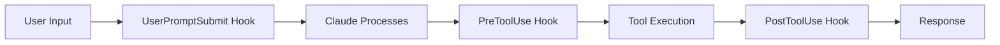

# Hooks Overview

!!! info "Complete Control Over Claude Code"
    Hooks provide deterministic control over Claude Code's behavior through 8 lifecycle events, allowing you to validate, modify, and control every aspect of the AI's actions.

## What Are Hooks?

Hooks are executable scripts that run at specific points in Claude Code's lifecycle. They receive JSON input via stdin and return JSON output to control execution flow.



## Available Hooks

<div class="grid cards" markdown>

-   :material-play-circle:{ .lg .middle } **SessionStart**

    ---

    Initializes your development environment when Claude Code starts

    ```python
    def session_start(event):
        setup_environment()
        load_context()
    ```

-   :material-text-box:{ .lg .middle } **UserPromptSubmit**

    ---

    Validates and enhances user prompts before processing

    ```python
    def user_prompt_submit(event):
        prompt = enhance_prompt(event['prompt'])
        return {"prompt": prompt}
    ```

-   :material-shield:{ .lg .middle } **PreToolUse**

    ---

    Security gate for all tool operations

    ```python
    def pre_tool_use(event):
        if is_dangerous(event):
            return {"action": "block"}
    ```

-   :material-check:{ .lg .middle } **PostToolUse**

    ---

    Validates and logs tool execution results

    ```python
    def post_tool_use(event):
        log_result(event['result'])
        validate_output(event)
    ```

</div>

## Quick Example

Create `.claude/hooks/pre_tool_use.py`:

```python title="pre_tool_use.py"
#!/usr/bin/env python3
import json
import sys

def pre_tool_use_hook(event):
    """Security validation before tool execution"""
    
    tool_name = event.get("tool_name")
    params = event.get("params", {})
    
    # Block dangerous bash commands
    if tool_name == "Bash":
        command = params.get("command", "")
        dangerous = ["rm -rf", "sudo", "chmod 777", "curl | sh"]
        
        for danger in dangerous:
            if danger in command:
                return {
                    "action": "block",
                    "message": f"Blocked dangerous command: {danger}"
                }
    
    # Allow safe operations
    return {"action": "allow"}

if __name__ == "__main__":
    event = json.loads(sys.stdin.read())
    result = pre_tool_use_hook(event)
    print(json.dumps(result))
```

## Configuration

Configure hooks in `.claude/settings.json`:

```json
{
  "hooks": {
    "preToolUse": ".claude/hooks/pre_tool_use.py",
    "postToolUse": ".claude/hooks/post_tool_use.py",
    "userPromptSubmit": ".claude/hooks/user_prompt_submit.py"
  }
}
```

## Best Practices

!!! tip "Security First"
    Always implement `preToolUse` hooks to validate dangerous operations

!!! warning "Error Handling"
    Always return valid JSON, even on errors. Default to `{"action": "allow"}` to prevent blocking Claude

!!! success "Performance"
    Keep hooks lightweight - they run synchronously and can impact response time

## Hook Communication

### Input Format

```json
{
  "event_type": "pre_tool_use",
  "tool_name": "Bash",
  "params": {
    "command": "ls -la"
  },
  "context": {
    "session_id": "abc123",
    "timestamp": "2025-01-01T00:00:00Z"
  }
}
```

### Response Format

```json
{
  "action": "allow|block|modify",
  "message": "Optional message",
  "modified_params": {}
}
```

## Integration with Monitoring

Hooks can send events to the monitoring dashboard:

```python
import requests

def post_tool_use(event):
    # Send to monitoring
    requests.post("http://localhost:8080/events", json={
        "type": "tool_executed",
        "tool": event["tool_name"],
        "duration": event["duration"]
    })
    
    return {"action": "allow"}
```

## Next Steps

<div class="grid cards" markdown>

-   :material-clock:{ .lg .middle } **[Lifecycle Events](lifecycle.md)**
    
    Deep dive into all 8 hook events

-   :material-security:{ .lg .middle } **[Security Patterns](security.md)**
    
    Implement bulletproof security

-   :material-code-braces:{ .lg .middle } **[Examples](examples.md)**
    
    Production-ready hook implementations

-   :material-bug:{ .lg .middle } **[Debugging](debugging.md)**
    
    Test and debug your hooks

</div>