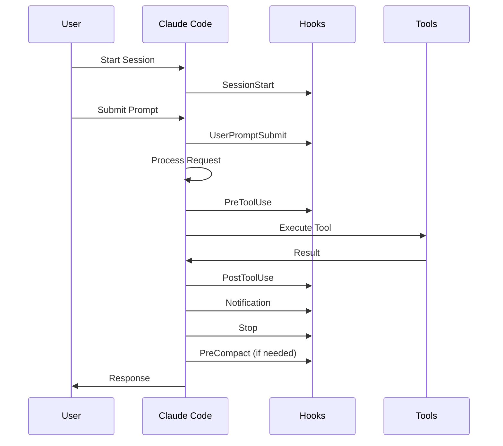

# Hook Lifecycle Events

## Complete Lifecycle Overview



## 1. SessionStart

Triggered when a new Claude Code session begins.

### Use Cases
- Initialize development environment
- Load project context
- Set up monitoring
- Configure tools

### Example Implementation

```python title="session_start.py"
#!/usr/bin/env python3
import json
import sys
import os
from datetime import datetime

def session_start(event):
    """Initialize session with project context"""
    
    session_id = event.get("session_id")
    project_path = event.get("project_path", os.getcwd())
    
    # Load project configuration
    config = load_project_config(project_path)
    
    # Initialize monitoring
    init_monitoring(session_id)
    
    # Set up environment
    setup_environment(config)
    
    # Log session start
    log_event("session_started", {
        "session_id": session_id,
        "project": project_path,
        "timestamp": datetime.now().isoformat()
    })
    
    return {
        "action": "continue",
        "context": config
    }

def load_project_config(path):
    """Load project-specific configuration"""
    config_file = os.path.join(path, ".claude", "config.json")
    if os.path.exists(config_file):
        with open(config_file, 'r') as f:
            return json.load(f)
    return {}

def init_monitoring(session_id):
    """Start monitoring for this session"""
    # Initialize monitoring dashboard
    pass

def setup_environment(config):
    """Configure environment based on project"""
    # Set environment variables
    # Configure tools
    pass

def log_event(event_type, data):
    """Log to monitoring system"""
    with open("claude_events.log", 'a') as f:
        f.write(json.dumps({
            "type": event_type,
            "data": data
        }) + "\n")

if __name__ == "__main__":
    event = json.loads(sys.stdin.read())
    result = session_start(event)
    print(json.dumps(result))
```

## 2. UserPromptSubmit

Processes user input before Claude analyzes it.

### Features
- Prompt enhancement
- Context injection
- Security validation
- Template expansion

### Example Implementation

```python title="user_prompt_submit.py"
#!/usr/bin/env python3
import json
import sys
import re

def user_prompt_submit(event):
    """Enhance and validate user prompts"""
    
    prompt = event.get("prompt", "")
    context = event.get("context", {})
    
    # Security check
    if contains_sensitive_info(prompt):
        return {
            "action": "block",
            "message": "Prompt contains sensitive information"
        }
    
    # Enhance prompt with context
    enhanced_prompt = enhance_prompt(prompt, context)
    
    # Add coding standards
    if is_coding_request(prompt):
        enhanced_prompt += "\n\nPlease follow these standards:\n"
        enhanced_prompt += "- Include comprehensive error handling\n"
        enhanced_prompt += "- Add type hints for Python\n"
        enhanced_prompt += "- Write clear docstrings\n"
        enhanced_prompt += "- Include unit tests\n"
    
    return {
        "action": "continue",
        "prompt": enhanced_prompt
    }

def contains_sensitive_info(prompt):
    """Check for sensitive patterns"""
    patterns = [
        r'api[_-]?key',
        r'password',
        r'secret',
        r'token',
        r'credential'
    ]
    
    for pattern in patterns:
        if re.search(pattern, prompt, re.IGNORECASE):
            return True
    return False

def enhance_prompt(prompt, context):
    """Add contextual information"""
    enhanced = prompt
    
    # Add project context
    if context.get("project_type"):
        enhanced = f"[Project: {context['project_type']}]\n{enhanced}"
    
    # Expand templates
    enhanced = expand_templates(enhanced)
    
    return enhanced

def expand_templates(prompt):
    """Expand prompt templates"""
    templates = {
        "@security": "Ensure security best practices including input validation and sanitization",
        "@performance": "Optimize for performance and scalability",
        "@test": "Include comprehensive unit and integration tests"
    }
    
    for template, expansion in templates.items():
        prompt = prompt.replace(template, expansion)
    
    return prompt

def is_coding_request(prompt):
    """Detect if prompt is asking for code"""
    coding_keywords = [
        'function', 'class', 'implement', 'create', 'build',
        'code', 'program', 'script', 'api', 'endpoint'
    ]
    
    prompt_lower = prompt.lower()
    return any(keyword in prompt_lower for keyword in coding_keywords)

if __name__ == "__main__":
    event = json.loads(sys.stdin.read())
    result = user_prompt_submit(event)
    print(json.dumps(result))
```

## 3. PreToolUse

Critical security gate before any tool execution.

### Security Features
- Command validation
- Path traversal prevention
- Resource limits
- Permission checking

### Example Implementation

```python title="pre_tool_use.py"
#!/usr/bin/env python3
import json
import sys
import re
import os
from pathlib import Path

class SecurityValidator:
    """Comprehensive security validation"""
    
    DANGEROUS_COMMANDS = [
        r'rm\s+-rf\s+/',
        r'rm\s+-rf\s+~',
        r'chmod\s+777',
        r'sudo\s+',
        r'curl.*\|\s*sh',
        r'wget.*\|\s*sh',
        r'eval\(',
        r'exec\(',
    ]
    
    PROTECTED_PATHS = [
        '/etc',
        '/sys',
        '/proc',
        '~/.ssh',
        '~/.aws',
    ]
    
    PROTECTED_FILES = [
        '.env',
        'credentials',
        'secrets',
        'private_key',
    ]
    
    def validate(self, event):
        """Main validation entry point"""
        tool_name = event.get("tool_name")
        params = event.get("params", {})
        
        validators = {
            "Bash": self.validate_bash,
            "Write": self.validate_write,
            "Edit": self.validate_edit,
            "MultiEdit": self.validate_edit,
            "Delete": self.validate_delete,
        }
        
        if tool_name in validators:
            return validators[tool_name](params)
        
        return {"action": "allow"}
    
    def validate_bash(self, params):
        """Validate bash commands"""
        command = params.get("command", "")
        
        # Check dangerous patterns
        for pattern in self.DANGEROUS_COMMANDS:
            if re.search(pattern, command, re.IGNORECASE):
                return {
                    "action": "block",
                    "message": f"Dangerous command pattern detected: {pattern}"
                }
        
        # Check resource limits
        if "fork" in command or ":(){ :|:& };:" in command:
            return {
                "action": "block",
                "message": "Fork bomb detected"
            }
        
        return {"action": "allow"}
    
    def validate_write(self, params):
        """Validate file write operations"""
        file_path = params.get("file_path", "")
        
        # Check protected files
        for protected in self.PROTECTED_FILES:
            if protected in file_path.lower():
                return {
                    "action": "block",
                    "message": f"Cannot modify protected file: {protected}"
                }
        
        # Check protected paths
        for protected_path in self.PROTECTED_PATHS:
            if file_path.startswith(protected_path):
                return {
                    "action": "block",
                    "message": f"Cannot write to protected path: {protected_path}"
                }
        
        # Check path traversal
        if "../" in file_path:
            return {
                "action": "block",
                "message": "Path traversal detected"
            }
        
        return {"action": "allow"}
    
    def validate_edit(self, params):
        """Validate file edit operations"""
        return self.validate_write(params)
    
    def validate_delete(self, params):
        """Validate delete operations"""
        file_path = params.get("file_path", "")
        
        # Extra strict for deletions
        if file_path == "/" or file_path == "~":
            return {
                "action": "block",
                "message": "Cannot delete root directories"
            }
        
        return self.validate_write(params)

def pre_tool_use(event):
    """Main hook entry point"""
    validator = SecurityValidator()
    result = validator.validate(event)
    
    # Log all tool use attempts
    log_tool_use(event, result)
    
    return result

def log_tool_use(event, result):
    """Log tool use for audit"""
    import time
    log_entry = {
        "timestamp": time.time(),
        "tool": event.get("tool_name"),
        "params": event.get("params"),
        "result": result["action"]
    }
    
    with open("tool_audit.log", 'a') as f:
        f.write(json.dumps(log_entry) + "\n")

if __name__ == "__main__":
    event = json.loads(sys.stdin.read())
    result = pre_tool_use(event)
    print(json.dumps(result))
```

## 4. PostToolUse

Validates and processes tool execution results.

```python title="post_tool_use.py"
#!/usr/bin/env python3
import json
import sys
import hashlib

def post_tool_use(event):
    """Process tool execution results"""
    
    tool_name = event.get("tool_name")
    result = event.get("result", {})
    duration = event.get("duration_ms", 0)
    
    # Check for errors
    if result.get("error"):
        handle_error(tool_name, result["error"])
    
    # Validate output
    if not validate_output(tool_name, result):
        return {
            "action": "retry",
            "message": "Invalid output detected"
        }
    
    # Track metrics
    track_metrics(tool_name, duration)
    
    # Cache results if appropriate
    if should_cache(tool_name, event):
        cache_result(event, result)
    
    return {"action": "continue"}

def validate_output(tool_name, result):
    """Validate tool output"""
    # Check for sensitive data in output
    output_str = str(result)
    sensitive_patterns = ["password", "api_key", "secret"]
    
    for pattern in sensitive_patterns:
        if pattern in output_str.lower():
            # Redact sensitive information
            result["output"] = "[REDACTED]"
            return True
    
    return True

def track_metrics(tool_name, duration):
    """Track performance metrics"""
    metrics = {
        "tool": tool_name,
        "duration_ms": duration,
        "timestamp": time.time()
    }
    
    # Send to monitoring
    send_to_monitoring(metrics)

def cache_result(event, result):
    """Cache for identical requests"""
    cache_key = generate_cache_key(event)
    # Store in cache
    pass

def generate_cache_key(event):
    """Generate cache key from event"""
    key_data = f"{event['tool_name']}:{json.dumps(event['params'])}"
    return hashlib.sha256(key_data.encode()).hexdigest()

if __name__ == "__main__":
    event = json.loads(sys.stdin.read())
    result = post_tool_use(event)
    print(json.dumps(result))
```

## 5. Additional Lifecycle Events

### Notification
Handles Claude's notifications and alerts.

### Stop
Executes when Claude finishes processing.

### SubagentStop
Manages subagent completion.

### PreCompact
Optimizes context before token limits.

## Hook Execution Order

1. **SessionStart** → Once per session
2. **UserPromptSubmit** → Each user input
3. **PreToolUse** → Before each tool
4. **PostToolUse** → After each tool
5. **Notification** → As needed
6. **Stop** → End of processing
7. **SubagentStop** → Subagent completion
8. **PreCompact** → Context management

## Best Practices

!!! tip "Chain of Responsibility"
    Each hook should focus on a single responsibility

!!! warning "Performance Impact"
    Hooks run synchronously - keep them fast

!!! success "Fail Safe"
    Always return valid JSON, default to allowing actions

## Next: [Security Patterns →](security.md)