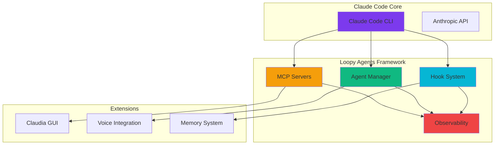

# Welcome to Loopy Agents

<div align="center">


**Master Claude Code with Advanced Hooks, Agents, and MCP Servers**

[](https://github.com/looptech-ai/loopy-agents)
[](https://looptech-ai.github.io/loopy-agents-doc)
[](LICENSE)

</div>

## 🚀 Quick Start

Get up and running with Claude Code in minutes:

=== "Install Claude Code"

    ```bash
    # Install Claude Code CLI
    npm install -g @anthropic/claude-code
    
    # Or use the installer
    curl -fsSL https://claude.ai/install.sh | sh
    
    # Verify installation
    claude --version
    ```

=== "Setup Loopy Agents"

    ```bash
    # Clone the repository
    git clone https://github.com/looptech-ai/loopy-agents.git
    cd loopy-agents
    
    # Install dependencies
    pip install -r requirements.txt
    npm install
    
    # Initialize configuration
    ./scripts/setup.sh
    ```

=== "First Hook"

    ```python
    # .claude/hooks/safety.py
    import json
    import sys
    
    def pre_tool_use_hook(event):
        """Block dangerous commands"""
        tool_name = event.get("tool_name")
        params = event.get("params", {})
        
        # Block dangerous bash commands
        if tool_name == "Bash":
            command = params.get("command", "")
            dangerous = ["rm -rf", "sudo", "chmod 777"]
            
            for danger in dangerous:
                if danger in command:
                    return {
                        "action": "block",
                        "message": f"Blocked dangerous command: {danger}"
                    }
        
        return {"action": "allow"}
    
    if __name__ == "__main__":
        event = json.loads(sys.stdin.read())
        result = pre_tool_use_hook(event)
        print(json.dumps(result))
    ```

## 🎯 What is Loopy Agents?

Loopy Agents is a comprehensive framework for extending Claude Code with:

<div class="grid cards" markdown>

-   :material-hook:{ .lg .middle } **Advanced Hooks**

    ---

    Implement all 8 lifecycle events with security-focused patterns, validation frameworks, and JSON-based flow control

    [:octicons-arrow-right-24: Learn about hooks](hooks/index.md)

-   :material-robot:{ .lg .middle } **Intelligent Agents**

    ---

    Create single-file agents, multi-agent systems, voice-enabled assistants, and infinite loops

    [:octicons-arrow-right-24: Explore agents](agents/index.md)

-   :material-server:{ .lg .middle } **MCP Servers**

    ---

    Connect to multiple LLM providers, implement custom tools, and create unified interfaces

    [:octicons-arrow-right-24: Setup MCP](mcp/index.md)

-   :material-eye:{ .lg .middle } **Real-time Observability**

    ---

    Monitor multi-agent systems, track performance metrics, and debug with visual tools

    [:octicons-arrow-right-24: View monitoring](observability/index.md)

</div>

## 📊 Architecture Overview



## 🌟 Key Features

### 🔒 Security First
- Command blocking patterns
- Sandboxed execution
- Result validation
- Granular permissions

### ⚡ Performance Optimized
- Parallel agent execution
- Token usage tracking
- Cost optimization
- Cache strategies

### 🎨 Developer Experience
- Single-file agents
- Voice-enabled coding
- Visual debugging
- Hot reloading

### 🤝 Team Collaboration
- Shared memory system
- Git-based workflows
- Multi-agent coordination
- Real-time monitoring

## 📚 Documentation Structure

<div class="grid cards" markdown>

-   **Getting Started**
    
    Installation, setup, and your first agent
    
    - [Installation Guide](getting-started.md)
    - [Quick Tutorial](examples/quick-start.md)
    - [Architecture Overview](architecture.md)

-   **Core Concepts**
    
    Deep dives into framework components
    
    - [Hook Lifecycle](hooks/lifecycle.md)
    - [Agent Patterns](agents/patterns.md)
    - [Memory Hierarchy](memory/hierarchy.md)

-   **Advanced Topics**
    
    Production-ready patterns and optimization
    
    - [Multi-Agent Systems](agents/multi-agent.md)
    - [Custom MCP Servers](mcp/custom-servers.md)
    - [Performance Tuning](patterns/performance.md)

-   **Reference**
    
    Complete API documentation and guides
    
    - [Command Reference](reference/commands.md)
    - [API Documentation](reference/api.md)
    - [Troubleshooting](reference/troubleshooting.md)

</div>

## 🛠️ Example: Multi-Agent System

```python title="examples/multi_agent_system.py"
#!/usr/bin/env python3
"""
Multi-agent system with real-time monitoring
"""

from loopy_agents import AgentManager, Agent, Monitor
from loopy_agents.hooks import lifecycle
import asyncio

# Define specialized agents
class CodeReviewer(Agent):
    """Reviews code for security and style issues"""
    system_prompt = """You are a senior code reviewer.
    Focus on security vulnerabilities and code quality."""
    
    tools = ["Read", "Grep", "Edit"]

class TestWriter(Agent):
    """Writes comprehensive test suites"""
    system_prompt = """You are a test automation expert.
    Write thorough tests with edge cases."""
    
    tools = ["Write", "Bash", "Edit"]

class Documenter(Agent):
    """Creates and maintains documentation"""
    system_prompt = """You are a technical writer.
    Create clear, comprehensive documentation."""
    
    tools = ["Write", "Edit", "Read"]

# Initialize monitoring
monitor = Monitor(port=8080)

# Create agent manager
manager = AgentManager(monitor=monitor)

# Register agents
manager.register(CodeReviewer())
manager.register(TestWriter())
manager.register(Documenter())

# Define workflow
async def development_workflow(task):
    """Orchestrate agents for development tasks"""
    
    # Phase 1: Code Review
    review_result = await manager.run_agent(
        "CodeReviewer",
        f"Review this code for issues: {task}"
    )
    
    # Phase 2: Test Creation (parallel)
    test_task = manager.run_agent(
        "TestWriter",
        f"Write tests based on review: {review_result}"
    )
    
    # Phase 3: Documentation (parallel)
    doc_task = manager.run_agent(
        "Documenter",
        f"Document the implementation: {task}"
    )
    
    # Wait for parallel tasks
    test_result, doc_result = await asyncio.gather(
        test_task, doc_task
    )
    
    return {
        "review": review_result,
        "tests": test_result,
        "docs": doc_result
    }

# Run with monitoring
if __name__ == "__main__":
    # Start monitoring dashboard
    monitor.start()
    
    # Execute workflow
    result = asyncio.run(
        development_workflow("implement user authentication")
    )
    
    print("Workflow completed!", result)
```

!!! tip "Pro Tip"
    Access the monitoring dashboard at `http://localhost:8080` to see real-time agent interactions, performance metrics, and event logs.

## 🎓 Learning Path

1. **Beginner** → Start with [Getting Started](getting-started.md)
2. **Intermediate** → Explore [Hooks](hooks/index.md) and [Single-File Agents](agents/single-file.md)
3. **Advanced** → Master [Multi-Agent Systems](agents/multi-agent.md) and [Custom MCP Servers](mcp/custom-servers.md)
4. **Expert** → Build [Production Patterns](patterns/index.md) and [Team Workflows](patterns/team-collaboration.md)

## 🤝 Community & Support

<div class="grid cards" markdown>

-   :material-github:{ .lg .middle } **GitHub**
    
    Star, fork, and contribute
    
    [looptech-ai/loopy-agents](https://github.com/looptech-ai/loopy-agents)

-   :material-discord:{ .lg .middle } **Discord**
    
    Join our community
    
    [discord.gg/loopy-agents](https://discord.gg/loopy-agents)

-   :material-youtube:{ .lg .middle } **YouTube**
    
    Video tutorials and demos
    
    [@looptech-ai](https://youtube.com/@looptech-ai)

-   :material-book:{ .lg .middle } **Blog**
    
    Articles and case studies
    
    [blog.looptech.ai](https://blog.looptech.ai)

</div>

## 📈 Statistics

- **5,000+** GitHub Stars across ecosystem
- **100+** Contributors
- **50+** Example agents
- **10+** MCP server integrations
- **8** Lifecycle hooks implemented
- **24/7** Real-time monitoring

## 🚦 Roadmap

- [x] Complete hook system implementation
- [x] Multi-agent orchestration
- [x] Real-time observability
- [x] Voice integration
- [ ] IDE plugins (VS Code, JetBrains)
- [ ] Cloud deployment patterns
- [ ] Enterprise features
- [ ] AI model marketplace

---

<div align="center">

**Ready to supercharge your Claude Code experience?**

[Get Started Now](getting-started.md){ .md-button .md-button--primary }
[View Examples](examples/index.md){ .md-button }

</div>