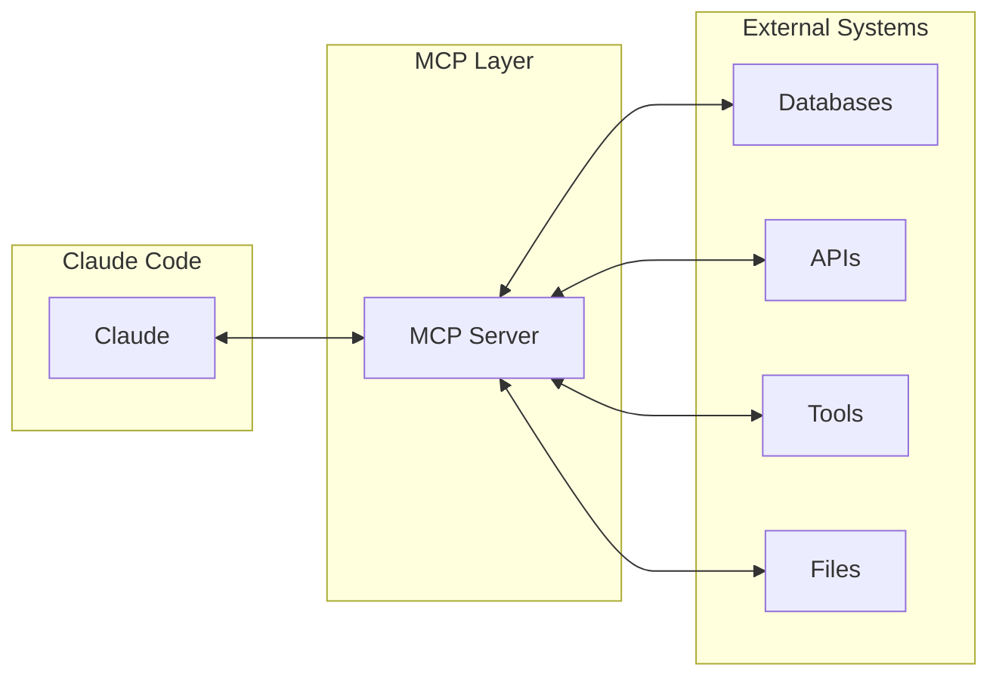

# MCP Servers Overview

!!! info "Model Context Protocol"
    MCP (Model Context Protocol) enables Claude Code to connect with external tools, databases, and APIs through a standardized interface.

## What is MCP?

The Model Context Protocol is an open standard for connecting AI assistants to external systems. It provides a unified way for Claude to interact with your tools and data sources.



## Available MCP Servers

<div class="grid cards" markdown>

-   :material-cloud-sync:{ .lg .middle } **Multi-Provider Server**

    ---

    Connect to multiple LLM providers through one interface

    ```json
    {
      "providers": ["openai", "anthropic", "groq"],
      "models": ["gpt-4", "claude-3", "llama-3"]
    }
    ```

-   :material-database:{ .lg .middle } **Database Server**

    ---

    Query and modify databases directly

    ```sql
    SELECT * FROM users 
    WHERE created_at > '2024-01-01'
    ```

-   :material-api:{ .lg .middle } **API Gateway**

    ---

    Interact with REST APIs and GraphQL endpoints

    ```python
    api.call("GET", "/users", params={})
    ```

-   :material-folder:{ .lg .middle } **File System**

    ---

    Enhanced file operations with permissions

    ```python
    fs.read_secure("/protected/file.txt")
    ```

</div>

## Quick Setup

### 1. Install MCP Server

```bash
# Clone the MCP server
git clone https://github.com/looptech-ai/mcp-servers.git
cd mcp-servers

# Install dependencies
pip install -r requirements.txt
```

### 2. Configure Claude Code

Add to `.claude/settings.json`:

```json
{
  "mcpServers": {
    "multi-provider": {
      "command": "python",
      "args": ["mcp_servers/multi_provider/server.py"],
      "env": {
        "OPENAI_API_KEY": "${OPENAI_API_KEY}",
        "ANTHROPIC_API_KEY": "${ANTHROPIC_API_KEY}"
      }
    },
    "database": {
      "command": "python",
      "args": ["mcp_servers/database/server.py"],
      "env": {
        "DATABASE_URL": "${DATABASE_URL}"
      }
    }
  }
}
```

### 3. Use in Claude Code

```bash
# List available MCP tools
claude mcp list

# Use specific MCP server
claude --mcp multi-provider "Compare responses from GPT-4 and Claude"
```

## Multi-Provider MCP Server

### Features
- Unified interface for all LLM providers
- Automatic failover and retry logic
- Cost tracking per provider
- Response caching

### Example Implementation

```python title="multi_provider_server.py"
#!/usr/bin/env python3
"""Multi-provider MCP server for LLM access"""

import json
import os
from typing import Dict, Any, List
import asyncio
from dataclasses import dataclass

@dataclass
class Provider:
    """LLM Provider configuration"""
    name: str
    api_key: str
    base_url: str
    models: List[str]
    
class MultiProviderMCP:
    """MCP server for multiple LLM providers"""
    
    def __init__(self):
        self.providers = self.load_providers()
        self.cache = {}
        
    def load_providers(self) -> Dict[str, Provider]:
        """Load provider configurations"""
        providers = {}
        
        # OpenAI
        if os.getenv("OPENAI_API_KEY"):
            providers["openai"] = Provider(
                name="openai",
                api_key=os.getenv("OPENAI_API_KEY"),
                base_url="https://api.openai.com/v1",
                models=["gpt-4", "gpt-3.5-turbo"]
            )
        
        # Anthropic
        if os.getenv("ANTHROPIC_API_KEY"):
            providers["anthropic"] = Provider(
                name="anthropic",
                api_key=os.getenv("ANTHROPIC_API_KEY"),
                base_url="https://api.anthropic.com/v1",
                models=["claude-3-opus", "claude-3-sonnet"]
            )
        
        # Groq
        if os.getenv("GROQ_API_KEY"):
            providers["groq"] = Provider(
                name="groq",
                api_key=os.getenv("GROQ_API_KEY"),
                base_url="https://api.groq.com/v1",
                models=["llama-3-70b", "mixtral-8x7b"]
            )
        
        return providers
    
    async def call_llm(self, provider: str, model: str, prompt: str) -> Dict[str, Any]:
        """Call specific LLM through provider"""
        
        # Check cache
        cache_key = f"{provider}:{model}:{hash(prompt)}"
        if cache_key in self.cache:
            return self.cache[cache_key]
        
        # Get provider
        if provider not in self.providers:
            raise ValueError(f"Provider {provider} not configured")
        
        provider_obj = self.providers[provider]
        
        # Make API call based on provider
        if provider == "openai":
            response = await self.call_openai(provider_obj, model, prompt)
        elif provider == "anthropic":
            response = await self.call_anthropic(provider_obj, model, prompt)
        elif provider == "groq":
            response = await self.call_groq(provider_obj, model, prompt)
        else:
            raise ValueError(f"Unknown provider: {provider}")
        
        # Cache response
        self.cache[cache_key] = response
        
        return response
    
    async def call_openai(self, provider: Provider, model: str, prompt: str) -> Dict[str, Any]:
        """Call OpenAI API"""
        import httpx
        
        async with httpx.AsyncClient() as client:
            response = await client.post(
                f"{provider.base_url}/chat/completions",
                headers={
                    "Authorization": f"Bearer {provider.api_key}",
                    "Content-Type": "application/json"
                },
                json={
                    "model": model,
                    "messages": [{"role": "user", "content": prompt}],
                    "temperature": 0.7
                }
            )
            
            return response.json()
    
    async def call_anthropic(self, provider: Provider, model: str, prompt: str) -> Dict[str, Any]:
        """Call Anthropic API"""
        import httpx
        
        async with httpx.AsyncClient() as client:
            response = await client.post(
                f"{provider.base_url}/messages",
                headers={
                    "x-api-key": provider.api_key,
                    "anthropic-version": "2023-06-01",
                    "Content-Type": "application/json"
                },
                json={
                    "model": model,
                    "messages": [{"role": "user", "content": prompt}],
                    "max_tokens": 1000
                }
            )
            
            return response.json()
    
    async def compare_responses(self, prompt: str, providers: List[str] = None) -> Dict[str, Any]:
        """Compare responses from multiple providers"""
        
        if providers is None:
            providers = list(self.providers.keys())
        
        tasks = []
        for provider in providers:
            provider_obj = self.providers[provider]
            model = provider_obj.models[0]  # Use first available model
            tasks.append(self.call_llm(provider, model, prompt))
        
        responses = await asyncio.gather(*tasks)
        
        return {
            "prompt": prompt,
            "responses": dict(zip(providers, responses)),
            "comparison": self.analyze_responses(responses)
        }
    
    def analyze_responses(self, responses: List[Dict[str, Any]]) -> Dict[str, Any]:
        """Analyze and compare responses"""
        # Compare response quality, length, etc.
        analysis = {
            "count": len(responses),
            "average_length": sum(len(str(r)) for r in responses) / len(responses)
        }
        
        return analysis

# MCP Server Interface
class MCPServer:
    """MCP server interface"""
    
    def __init__(self):
        self.multi_provider = MultiProviderMCP()
    
    async def handle_request(self, request: Dict[str, Any]) -> Dict[str, Any]:
        """Handle MCP request"""
        
        method = request.get("method")
        params = request.get("params", {})
        
        if method == "call_llm":
            return await self.multi_provider.call_llm(
                params["provider"],
                params["model"],
                params["prompt"]
            )
        elif method == "compare":
            return await self.multi_provider.compare_responses(
                params["prompt"],
                params.get("providers")
            )
        else:
            raise ValueError(f"Unknown method: {method}")
    
    def run(self):
        """Run MCP server"""
        import sys
        
        while True:
            try:
                # Read request from stdin
                line = sys.stdin.readline()
                if not line:
                    break
                
                request = json.loads(line)
                
                # Process request
                response = asyncio.run(self.handle_request(request))
                
                # Write response to stdout
                print(json.dumps(response))
                sys.stdout.flush()
                
            except Exception as e:
                error_response = {
                    "error": str(e),
                    "type": type(e).__name__
                }
                print(json.dumps(error_response))
                sys.stdout.flush()

if __name__ == "__main__":
    server = MCPServer()
    server.run()
```

## Best Practices

!!! tip "Environment Variables"
    Store API keys in environment variables, never hardcode

!!! warning "Error Handling"
    Implement retry logic and fallback providers

!!! success "Caching"
    Cache responses to reduce API costs

!!! info "Monitoring"
    Track usage and costs per provider

## MCP Protocol Specification

### Request Format
```json
{
  "method": "tool_name",
  "params": {
    "key": "value"
  },
  "id": "unique_request_id"
}
```

### Response Format
```json
{
  "result": {
    "data": "response_data"
  },
  "id": "unique_request_id"
}
```

## Available MCP Servers

1. **[Multi-Provider](multi-provider.md)** - Connect to multiple LLMs
2. **[Database](database.md)** - Database operations
3. **[File System](filesystem.md)** - Enhanced file operations
4. **[Web Search](websearch.md)** - Internet search capabilities
5. **[Custom Tools](custom-servers.md)** - Build your own

## Next Steps

<div class="grid cards" markdown>

-   :material-rocket-launch:{ .lg .middle } **[Quick Start](../getting-started.md)**
    
    Get started with MCP

-   :material-server:{ .lg .middle } **[Custom Servers](custom-servers.md)**
    
    Build your own MCP server

-   :material-integration:{ .lg .middle } **[Integration](integration.md)**
    
    Integrate with Claude Code

-   :material-api:{ .lg .middle } **[API Reference](../reference/api.md)**
    
    Complete API documentation

</div>